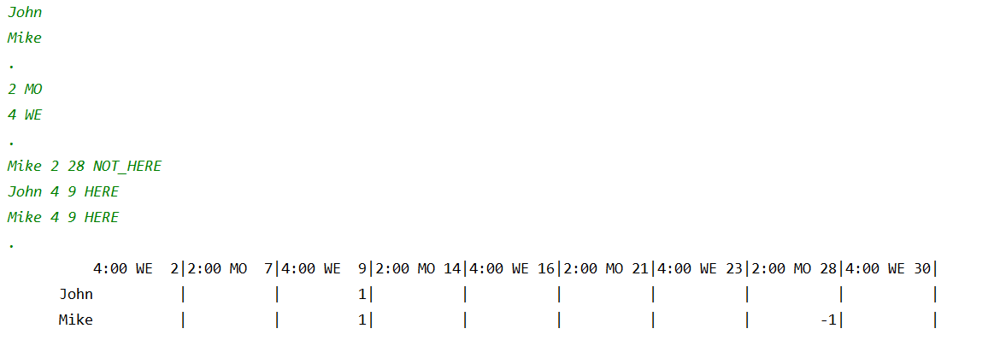

# Java Bootcamp - Day 00

## Contents
- [Preamble](#preamble)
- [General Rules](#general-rules)
- [Rules of the Day](#rules-of-the-day)
- [Exercise 00 – Sum of Digits](#exercise-00-–-sum-of-digits)
- [Exercise 01 – Really Prime Number](#exercise-01-–-really-prime-number)
- [Exercise 02 – Endless Sequence (or not?)](#exercise-02-–-endless-sequence-or-not)
- [Exercise 03 – A Little Bit of Statistics](#exercise-03-–-a-little-bit-of-statistics)
- [Exercise 04 – A Bit More of Statistics](#exercise-04-–-a-bit-more-of-statistics)

## Preamble
Java version for this bootcamp is 1.8. Make sure it's installed on your machine. You can use any IDE to write and debug your code. Your code should adhere to Oracle's standard coding practices.

## General Rules
- Only Java version 1.8 should be used.
- Code should be in your GIT repository.
- Your code will be evaluated by your peers.

## Rules of the Day
- No user-defined methods and classes except for static functions and procedures in the main class.
- You can use `System::exit`.

## Exercise 00 – Sum of Digits
**Allowed**: `System.out`, Primitive types, Standard operations of primitive types  
**Task**: Calculate the sum of digits of a six-digit int number.

Example of the program operation for number 479598:
```
$ java Program
  42
```

## Exercise 01 – Really Prime Number
**Allowed**: `System.out`, `System.err`, `Scanner(System.in)`, Primitive types, Conditions, Loops  
**Task**: Check if the input number is a prime number.

Example of program operation:

```
$ java Program
-> 169
   false 12

$ java Program
-> 113
   true 10

$ java Program
-> 42
   false 1

$ java Program
-> -100 
   Illegal Argument
```


## Exercise 02 – Endless Sequence (or not?)
**Allowed**: `System.out`, `System.err`, `Scanner(System.in)`, Primitive types, Conditions, Loops  
**Task**: Count the number of queries related to coffee preparation.

Example of program operation:

```
$ java Program
-> 198131
-> 12901212
-> 11122
-> 42
   Count of coffee-request – 2
```

## Exercise 03 – A Little Bit of Statistics
**Allowed**: `System.out`, `System.err`, `Scanner(System.in)`, Primitive types, `String::equals`  
**Task**: Display student's progress changes over several weeks without using arrays.

Example of program operation:

```
$ java Program
-> Week 1
-> 4 5 2 4 2
-> Week 2
-> 7 7 7 7 6
-> Week 3
-> 4 3 4 9 8
-> Week 4
-> 9 9 4 6 7
-> 42
Week 1 ==>
Week 2 ======>
Week 3 ===>
Week 4 ====>
```

## Exercise 04 – A Bit More of Statistics
**Allowed**: `System.out`, `System.err`, `Scanner(System.in)`, Primitive types, `String::equals`, `String::toCharArray`, `String::length`  
**Task**: Implement a program for counting a character occurrences in a text.

Example of program operation:

```
$ java Program

-> AAAAAAAAAAAAAAAAAAAAAAAAAAAAAAAAASSSSSSSSSSSSSSSSSSSSSSSSDDDDDDDDDDDDDDDDDDDDDDDDDDDDDDDDDWEWWKFKKDKKDSKAKLSLDKSKALLLLLLLLLLRTRTETWTWWWWWWWWWWOOOOOOO42

 36
  #  35
  #   #
  #   #  27
  #   #   #
  #   #   #
  #   #   #
  #   #   #  14  12
  #   #   #   #   #   9
  #   #   #   #   #   #   7   4
  #   #   #   #   #   #   #   #   2   2
  D   A   S   W   L   K   O   T   E   R
```

## Exercise 05 – Schedule

**Task**: You've recently gained recognition as a proficient hacker. Your client returns to you with a new request. They're planning to operate an educational establishment and need an MVP to manage the class schedules, specifically for the month of September 2020.

The requirements are as follows:
- You must be able to assemble a roster of students.
- The system should allow for the designation of class times and days. Classes can take place between 1 pm and 6 pm on any day of the week.
- There's a possibility of having multiple classes on the same day but the total number of classes for the week should not exceed 10.
  
Additionally, there can be up to 10 students on the timetable. Student names must not exceed 10 characters and cannot contain spaces.

You also need to offer a feature for tracking student attendance. For this, the class times and dates should be noted next to each student's name, along with an attendance status (either HERE or NOT_HERE). It is not required to track attendance for every class during the month.

The application will have the following life cycle:
1. Create a student roster.
2. Fill in the class timetable, inputting each class time and day of the week in a separate row.
3. Record student attendance.
4. Present the timetable in a tabulated form, complete with attendance statuses.

Each stage in the application's operation will be separated by a period ("."). It's assumed that all provided data will be accurate, except for the sequential ordering of classes when filling in the timetable.

Example of program operation:


